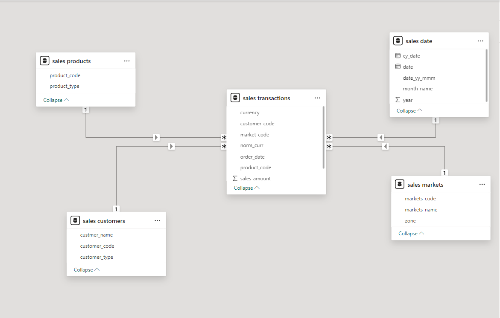
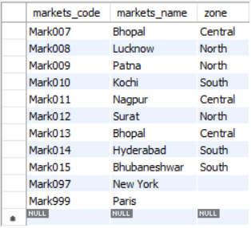
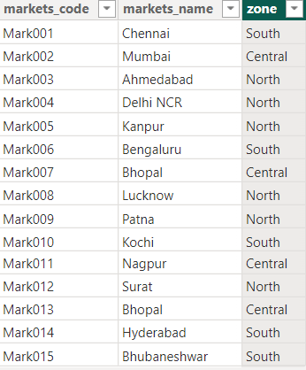
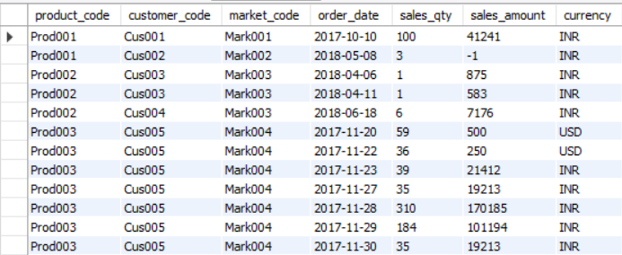
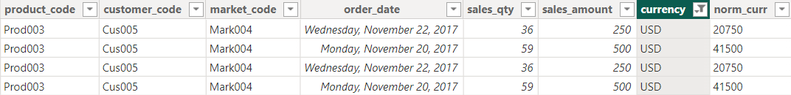

# Sales_DataAnalysis_PowerBI

 ## Description

 Data Analysis on a companies total sales of its various branches using Power BI.

 ## Data Modeling

 Star Schema model.
 

 ## Data Cleaning

 1. Sales Market Table:
   - Removed the entries which did not have any region as they were the transactions outside India and we are only focusing on the transactions in India as they are currently operating only in India.
   - Before
   
   - After
   
 2. Sales Transactions Table:
   - Removed the entries which had sales amount as 0 or in negative and added a new column norm_curr in which I converted all the USD sales amounts to INR to keep it consistent throughout for data analysis (1USD = 84INR).
   - Before 
    
   - After
    

 ## Things I learned

 - Data Modelling
 - PowerBI
 - Data transformation and cleaning
 - Exploratory Data Analysis

## Acknowledgement

Coding Challenge from a youtube channel codebasics Sales Insights Power BI project.
[codebasics](https://www.youtube.com/playlist?list=PLeo1K3hjS3uva8pk1FI3iK9kCOKQdz1I9)

