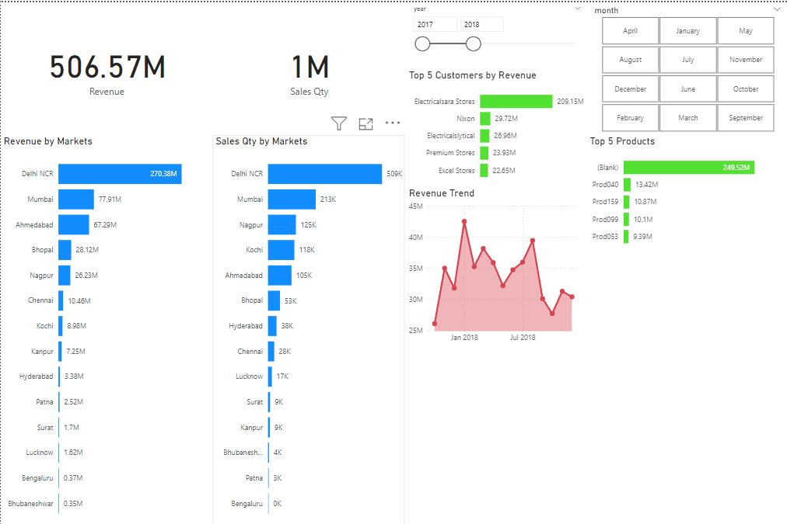
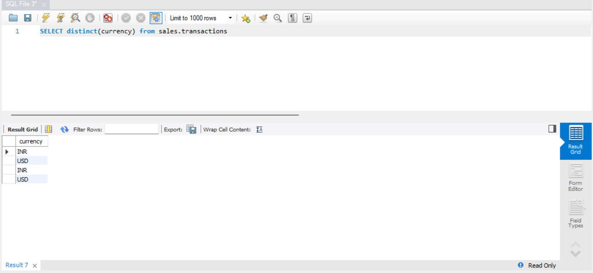
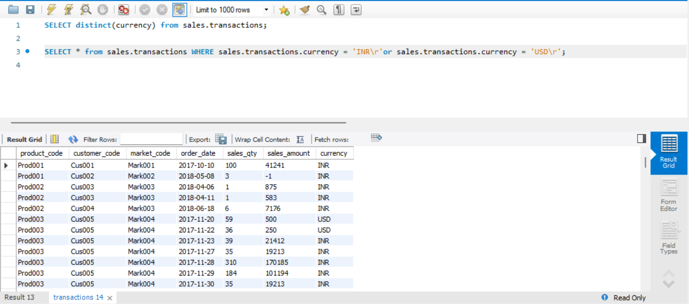
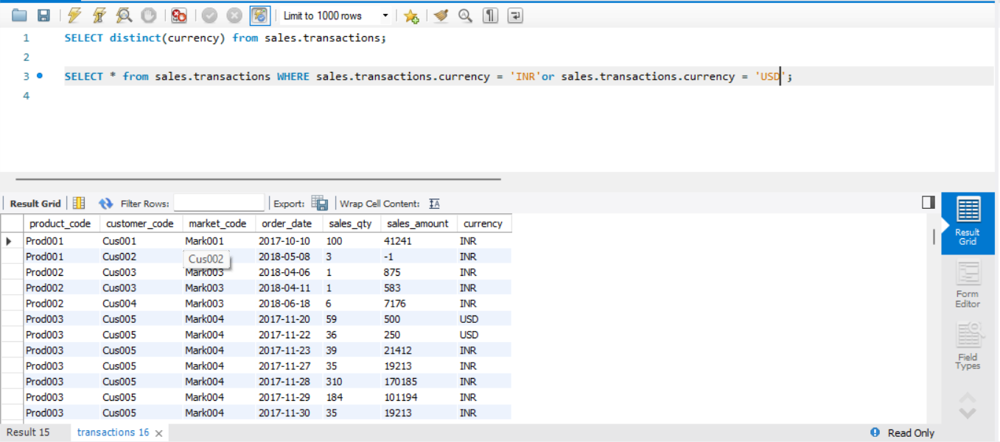
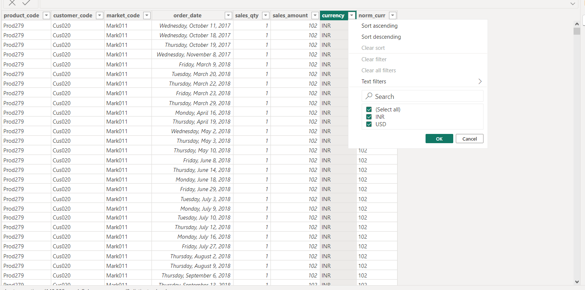

# Sales Data Analysis with Power BI

## Description

This project involves analyzing a company's total sales across various branches using Power BI.
**Report**

## Data Modeling

The data is structured using a Star Schema model.

## Data Cleaning

### 1. Sales Market Table:
- **Removed Non-India Entries**: Excluded transactions without a region specified, as they were outside India. The focus is solely on transactions within India, where the company operates.
  - **Before Cleaning**:
    - 
  - **After Cleaning**:
    - 

### 2. Sales Transactions Table:
- **Removed Invalid Entries**: Excluded transactions with a sales amount of zero or negative. Added a new column `norm_curr`, converting all USD amounts to INR for consistency (1 USD = 83 INR).
  - **Before Cleaning**:
    - 
  - **After Cleaning**:
    - 
- **Handled Currency Duplicates**: Addressed data duplication due to inconsistent currency types (`INR`, `INR/r`, `USD`, `USD/r`). Kept the rows with `INR/r` and `USD/r` as they had more reliable data and removed the duplicates (`INR` and `USD`).
  - **Before Cleaning**:
    - 
    - 
    - 
  - **After Cleaning**:
    - 

## Lessons Learned

- Data Modeling
- Power BI
- Data Transformation and Cleaning
- Exploratory Data Analysis

## Acknowledgments

This project is based on a coding challenge from the Codebasics YouTube channel's Sales Insights Power BI project. Special thanks to [Codebasics](https://www.youtube.com/playlist?list=PLeo1K3hjS3uva8pk1FI3iK9kCOKQdz1I9) for the guidance and resources.

